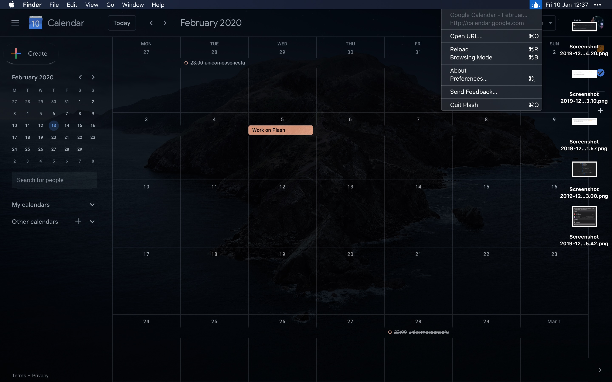

	
	<h1>Plash</h1>
	

		<b>Make any website your Mac desktop wallpaper</b>
	

	 
	 
	 

Plash enables you to have a highly dynamic desktop wallpaper. You could display your favorite news site, Facebook feed, or a random beautiful scenery photo. The use-cases are limitless. You could even set an animated GIF as wallpaper.

## Use-cases

- [**Random Unsplash image**](https://source.unsplash.com)\
	Example: https://source.unsplash.com/random/2880x1756?puppy \
		This returns a new random puppy image each time.
	See the [tip](#tips) on how to get exact screen size.
- [**Bing Photo of the Day**](https://github.com/sindresorhus/plash-bing-photo-of-the-day)
- **Calendar**\
	For example, Google Calendar or Outlook 365.
- **Personal stats**\
	You could even make a custom website for this.
- [**Random street view image**](https://randomstreetview.com/#slideshow)
- **Animated GIF**\
	Example: https://media3.giphy.com/media/xTiTnLmaxrlBHxsMMg/giphy.gif?cid=790b761121c10e72aca8bcfe50b030502b62a69ac7336782&rid=giphy.gif
- **Build a custom website**\
	You could build something quick and host it on [GitHub Pages](https://pages.github.com), [jsfiddle](https://jsfiddle.net), or [CodePen](https://codepen.io).

[*Share your use-case*](https://github.com/sindresorhus/Plash/issues/1)

## Features

- Show a remote or local website
- Interact with the website (“Browse Mode”)
- Automatically reload the website at a custom interval
- Show the website on a different display
- Invert website colors (fake dark mode)
- Add custom CSS to the website
- Lower the opacity
- [Transparent background](https://github.com/sindresorhus/Plash/issues/1#issuecomment-573513816)
- Automatically deactivate while on battery
- Audio is muted
- Single image will be aspect-filled to your screen

## Download

Requires macOS 10.15 or later.

You can try out the bleeding edge [here](https://install.appcenter.ms/users/sindresorhus/apps/plash/distribution_groups/public) (latest commit).

## Tips

### Browsing mode

You can interact with the website by enabling “Browsing Mode”. When in this mode, you can right-click to be able to go back/forward, reload, and zoom in the page contents (the zoom level is saved). You can also pinch to magnify. This is different from zooming the page contents in that it will zoom in to a specific part of the page instead of just enlarging everything.

### URL placeholders for screen width and height

Use `[[screenWidth]]` and `[[screenHeight]]` in any URL and Plash will substitute the right values for you. For example, `https://source.unsplash.com/random/[[screenWidth]]x[[screenHeight]]?puppy`.

## Screenshots

## FAQ

#### Can I contribute localizations?

We don't have any immediate plans to localize the app.

#### What does “Plash” mean?

[Click here.](http://letmegooglethat.com/?q=define+plash)

#### Can you add support for macOS 10.14 or older?

No, this app uses SwiftUI, which only works on macOS 10.15 and later.

#### Is this a native app?

Yes, it’s a native app written in Swift.

#### Can you port it to Windows/Linux?

No, I’m a Mac developer.

## Built with

- [Defaults](https://github.com/sindresorhus/Defaults) - Swifty and modern UserDefaults

## Related

- [Website](https://sindresorhus.com/plash)
- [Gifski](https://github.com/sindresorhus/Gifski) - Convert videos to high-quality GIFs
- [More apps…](https://sindresorhus.com/apps)
